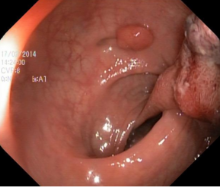
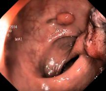
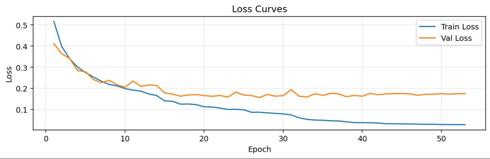
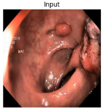
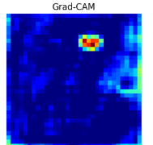

# 🩺 Kvasir-HealthAI: Advanced U-Net Pipeline for Gastrointestinal Polyp Segmentation


---

## 📘 Overview
**Kvasir-HealthAI** is an end-to-end deep learning pipeline for **gastrointestinal polyp segmentation** using the [Kvasir-SEG dataset](https://datasets.simula.no/kvasir-seg/).  
It features a modular design with preprocessing, training, and explainability stages — enabling reproducible, high-performance medical segmentation.

---

## ⚙️ Preprocessing Pipeline
**On-the-fly image enhancement** improves illumination uniformity and texture contrast.  
Each input frame passes through:

| Stage | Technique | Purpose |
|--------|------------|----------|
| 1️⃣ | Specular highlight removal | Reduces glare reflections |
| 2️⃣ | Homomorphic filtering | Corrects uneven illumination |
| 3️⃣ | Guided filtering | Smooths noise while preserving edges |
| 4️⃣ | CLAHE | Local contrast enhancement |
| 5️⃣ | Retoning | Normalizes brightness and tone range |

### Example
| Original | After Preprocessing |
|-----------|--------------------|
|  |  |

**Effect on training**
- Higher Dice & IoU  
- Fewer false negatives in low-contrast areas  
- Faster convergence and more stable learning  

---

## 🧠 Training Setup
```bash
python -m src.training.train
```
**Default Hyperparameters**

| Parameter | Value |
|------------|--------|
| Image Size | 256×256 |
| Batch Size | 8 |
| Epochs | 40 |
| Learning Rate | 1e-3 (Adam) |
| Loss Function | BCE + Dice |
| Scheduler | Cosine Annealing + Early Stopping |
| Device | CUDA / CPU auto-detect |

**Best Result**

**Performance Summary**

> 🎯 **Dice:** `0.8554`  📈 **IoU:** `0.7838`  ⚙️ **Learning Rate:** `3.75e-05`

---

## 📊 Results

| Metric | Value |
|---------|--------|
| **Dice** | 0.8554 |
| **IoU** | 0.7838 |
| **Validation Loss** | 0.1603 |
| **Train Loss** | 0.0416 |

### Training Curves

| Loss Curves | Metrics (Dice / IoU) |
|--------------|----------------------|
|  |  |

---

## 🔍 Explainability (XAI)

**SegGrad-CAM** is used to visualize the model’s focus regions during segmentation.  
It highlights the areas contributing most to the final prediction, enabling interpretability and reliability in medical AI systems.

### Visualization Example

| Input | Grad-CAM | Overlay |
|--------|-----------|----------|
|  |  |  |

---

## 🧰 Folder Structure

Kvasir-HealthAI/
│
├── src/
│   ├── dataset/                  # Dataset loading & augmentation
│   ├── models/                   # U-Net model definitions
│   ├── preprocessing/            # Image preprocessing pipeline
│   ├── training/                 # Loss, training loop, early stopping
│   ├── explainability/           # Grad-CAM integration
│   ├── utils/                    # Visualization & metrics
│
├── assets/
│   ├── images/                   # Raw sample visuals
│   ├── results/                  # Training logs, plots, checkpoints
│   ├── xai_visualizations/       # Grad-CAM outputs
│
├── examples/
│   ├── inference_example.py
│   ├── explainability_demo.py
│
├── README.md
├── setup.py
├── requirements.txt
└── LICENSE


---

## 🧪 Quick Inference

```python
from src.models.unet import UNet
from src.utils.visualization import overlay_mask
import torch, cv2

model = UNet(in_ch=3, out_ch=1, base=64)
model.load_state_dict(torch.load("assets/results/unet/best_unet.pt"))
model.eval()

img = cv2.imread("assets/images/test_sample.png")
x = torch.from_numpy(img.transpose(2,0,1)).unsqueeze(0).float()/255.
with torch.no_grad():
    mask = torch.sigmoid(model(x))[0,0].numpy()

```

## 🧭 Roadmap

- [ ] Add **Attention U-Net** and **U-Net++** variants  
- [ ] Deploy inference as **FastAPI + ONNX Runtime**  
- [ ] Integrate **Weights & Biases (wandb)** for experiment tracking  
- [ ] Enable **mixed precision** for Jetson / Edge AI deployment  
- [ ] Expand preprocessing for multi-center datasets  
- [ ] Publish pretrained models on **Hugging Face Hub**  

---

## 🧑‍💻 Author

**Ahmet Yasir Duman**  
Computer Engineer — *Healthcare AI & Computer Vision*  
📧 [ahmetyasirduman@gmail.com](mailto:ahmetyasirduman@gmail.com)  
🔗 [LinkedIn](https://www.linkedin.com/in/ahmetyasirduman) • [GitHub](https://github.com/ahmetduman23)

---
https://github.com/ahmetduman23/Kvasir-HealthAI

## 🩶 Citation

If you use this repository, please cite it as:

```bibtex
@misc{duman2025kvasirhealthai,
  author       = {Ahmet Yasir Duman},
  title        = {Kvasir-HealthAI: Advanced U-Net Pipeline for Gastrointestinal Polyp Segmentation},
  year         = {2025},
  url          = {https://github.com/ahmetduman23/Kvasir-HealthAI}
}

## 📜 License

This project is licensed under the **MIT License**.  
You are free to use, modify, and distribute the code with proper attribution.  
See the [LICENSE](LICENSE) file for complete details.

---

> **Kvasir-HealthAI** — bridging *Medical Imaging* and *Explainable Deep Learning.*

© 2025 Ahmet Yasir Duman — All rights reserved.
